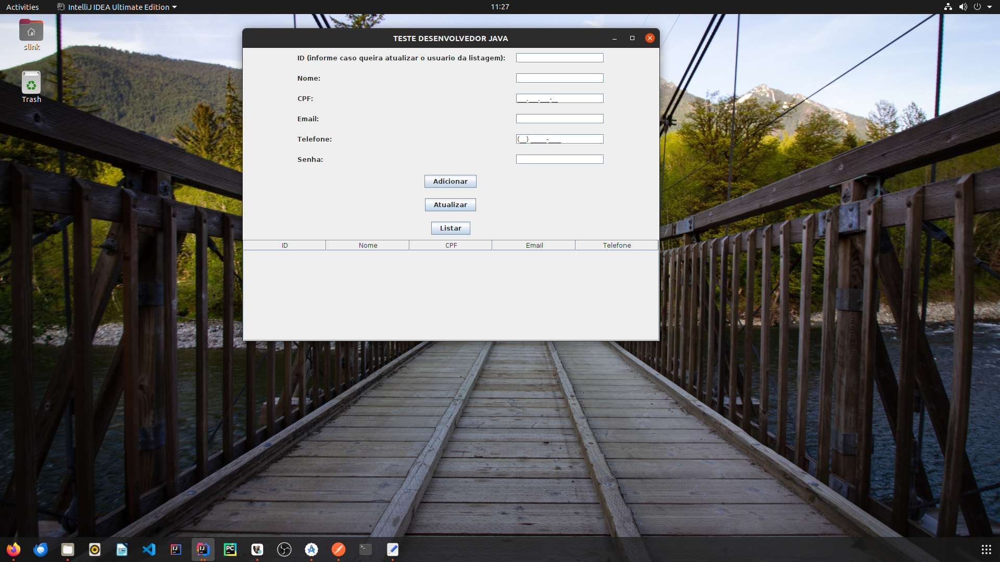
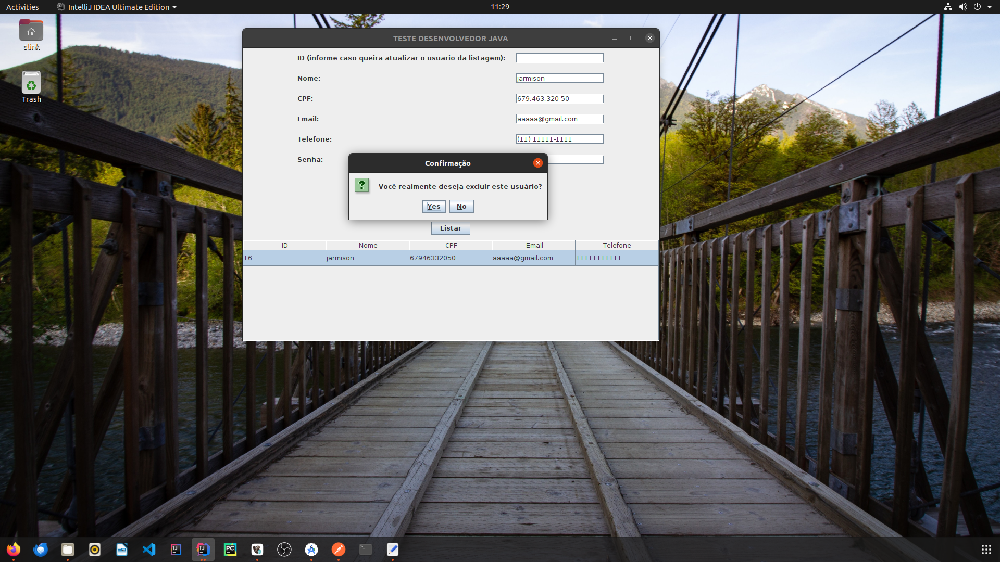
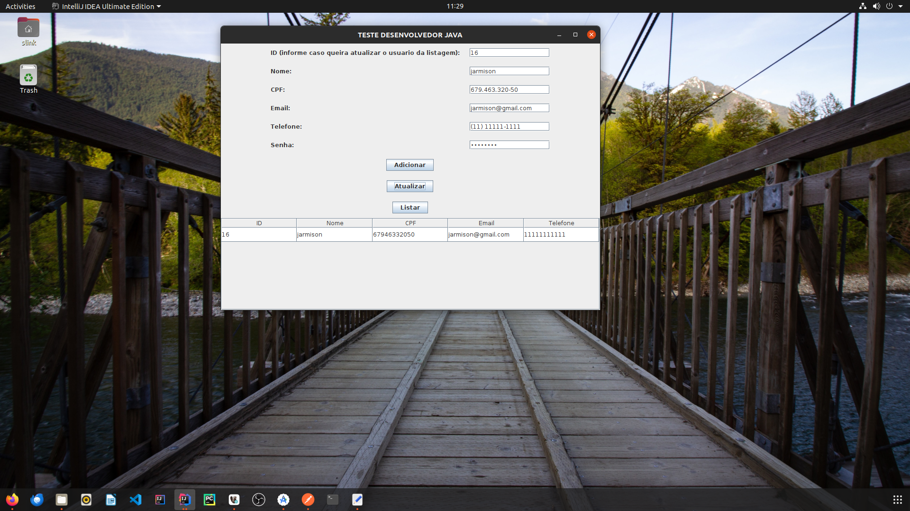
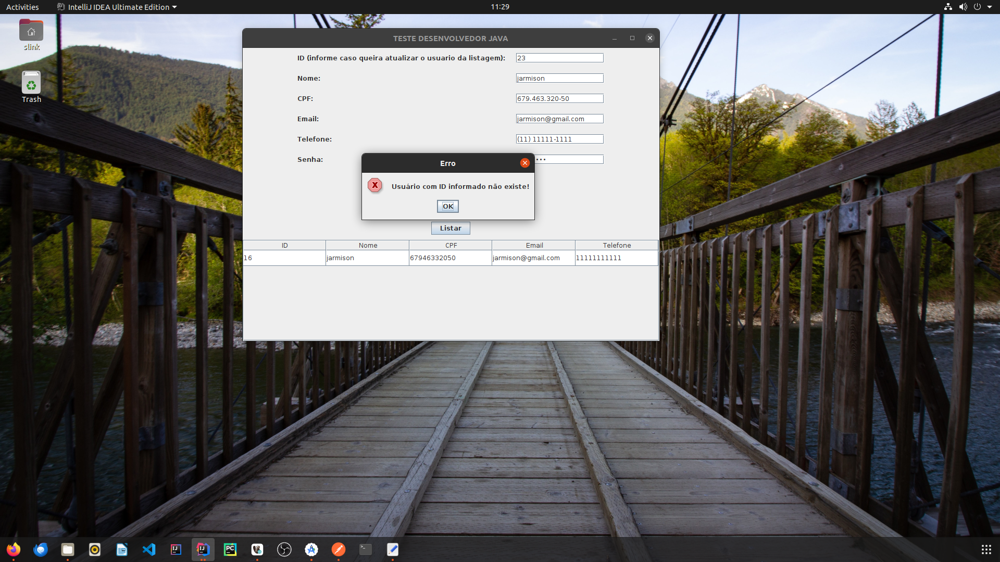

# Sistema de Gestão de Usuários

## Tecnologias Usadas

- **Backend**: 
  - [Java 8](https://www.oracle.com/java/technologies/javase/jdk17-archive-downloads.html) - Versão do Java utilizada no projeto.
  - [JPA/Hibernate](https://hibernate.org/) - Para persistência de dados.
  - [POSTGRESQL]

- **Frontend**: 
  - [Java Swing](https://docs.oracle.com/javase/tutorial/uiswing/) - Biblioteca para criação da interface gráfica do usuário.

## Funcionalidades

- **Adicionar Usuário**: Permite adicionar um novo usuário ao sistema com as seguintes informações:
  - Nome
  - CPF (validado)
  - Email
  - Telefone
  - Senha

- **Atualizar Usuário**: Permite atualizar as informações de um usuário existente com base no ID.

- **Listar Usuários**: Exibe uma tabela com todos os usuários cadastrados, mostrando ID, Nome, CPF, Email e Telefone.

- **Excluir Usuário**: Permite excluir um usuário selecionado da tabela.

## Validações

O sistema realiza as seguintes validações:

- **Validação de Campos Vazios**: Todos os campos devem ser preenchidos antes de adicionar ou atualizar um usuário.
- **Validação de CPF**: O CPF é validado para garantir que siga o formato correto e não seja uma sequência de números iguais.
- **Verificação de Duplicidade**: Não é permitido cadastrar usuários com CPFs já existentes.
- **Bycript**: Salvando a senha cripitada no banco com bycript.

## Imagens

Aqui estão algumas capturas de tela do sistema:

1. 
2. 
3. 
4. 
5. 
6. 
7. 
8. 
9. 
10. 
## Estrutura do Projeto

M - MODEL
V - VIEW
C - CONTROLLER

